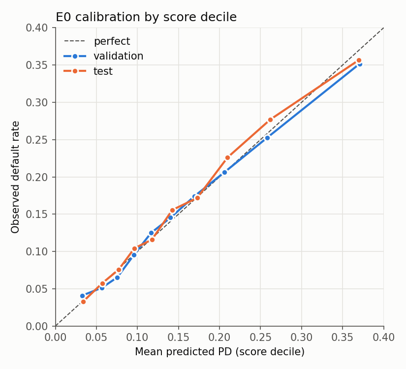
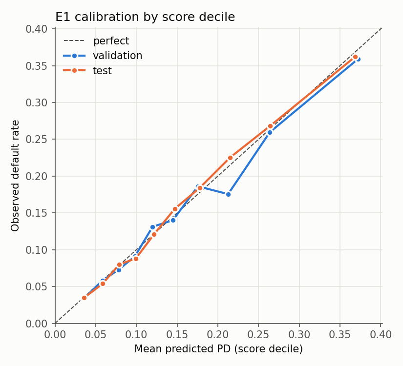
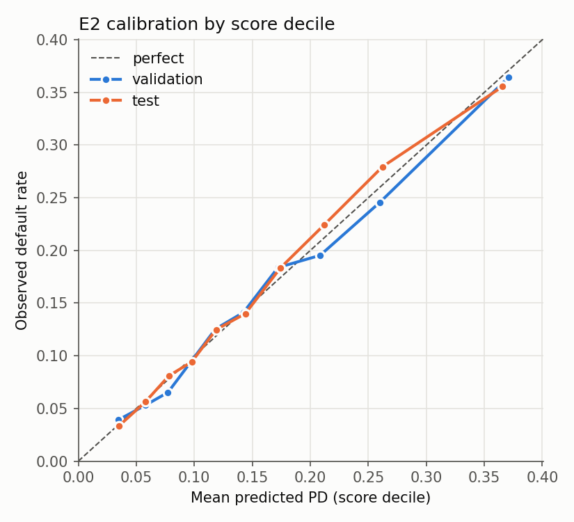
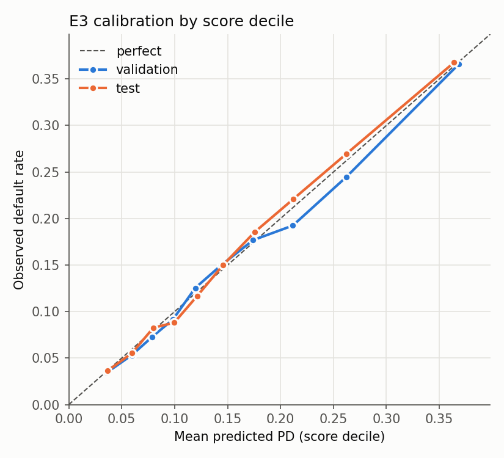
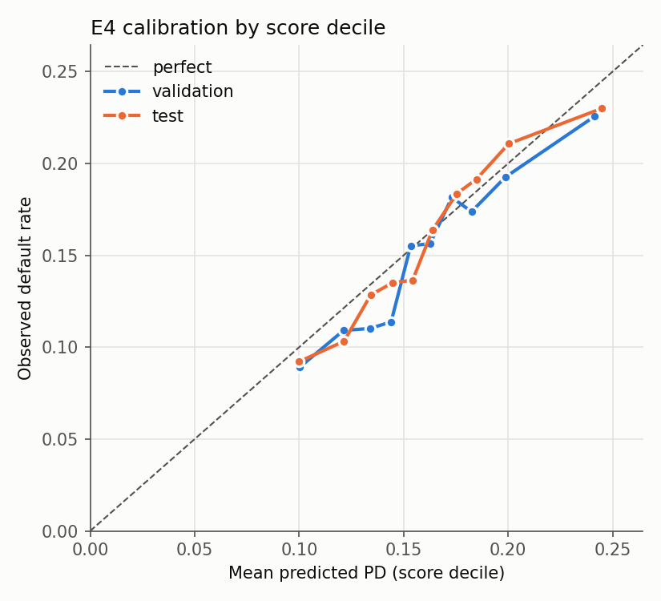
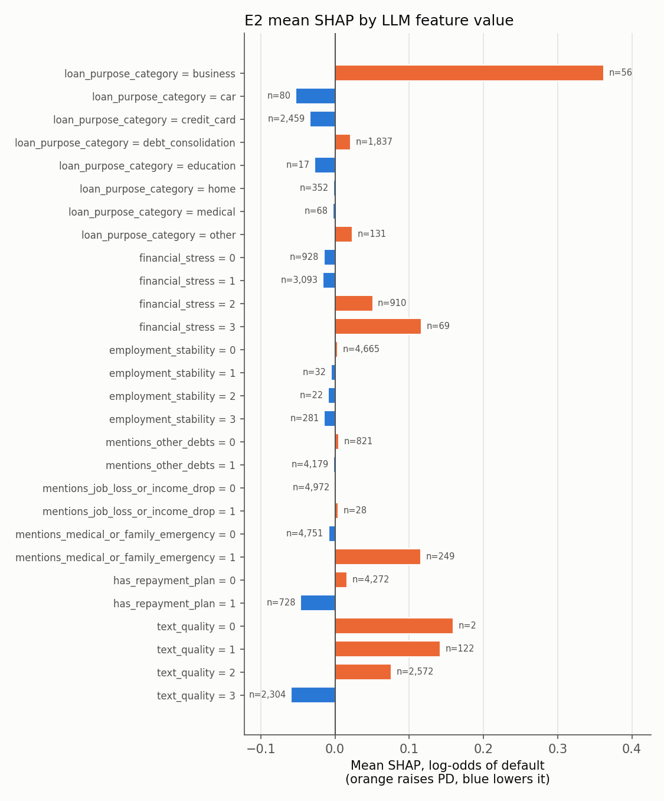
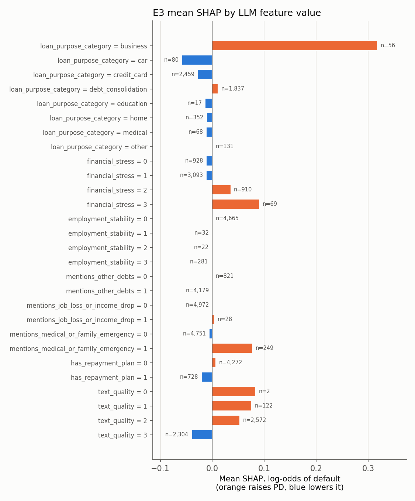

# Results: do LLM-derived text features improve a PD model?

_Generated by `python -m scripts.make_report` from `reports/runs/*/metrics.json`. Do not edit by hand._

## Summary

- **Embeddings (E1)** change test Gini by +0.0043 [-0.0017, +0.0102] vs the tabular baseline, one-sided p = 0.079 (not significant at 95%).
- **LLM features (E2)** change test Gini by +0.0014 [-0.0029, +0.0057], one-sided p = 0.254 (not significant at 95%).
- **Both together (E3)** change test Gini by +0.0037 [-0.0025, +0.0100], one-sided p = 0.131. That is no better than embeddings alone (+0.0043): the two text representations do not add up.
- **Text alone (E4, TF-IDF + LR)** reaches test Gini 0.1893 [0.1668, 0.2104]. The descriptions carry real default signal, but most of it overlaps with the tabular features.
- Baseline **E0** test Gini 0.4166 [0.3982, 0.4354], well calibrated (mean PD 0.154 vs observed 0.157), score PSI train→test 0.0024.

## Data and protocol

- Lending Club accepted loans 2007–2018. Row funnel: 2,260,701 (raw rows) → 2,260,668 (valid issue_d) → 1,348,099 (finished outcome (target 0/1)) → 125,700 (non-empty desc (>= 1 chars after cleaning)) → 125,700 (unique id).
- Out-of-time split by issue month (no month shared between splits):

| split | rows | first_month | last_month | share | default_rate |
|---|---|---|---|---|---|
| train | 88697 | 2007-06 | 2013-07 | 70.6% | 15.64% |
| val | 17145 | 2013-08 | 2013-11 | 13.6% | 15.07% |
| test | 19858 | 2013-12 | 2016-08 | 15.8% | 15.73% |

- All CatBoost experiments use identical settings, seed 42, early stopping on validation AUC. Test is only used for the numbers below. CIs: percentile bootstrap over test loans, 1000 resamples. Differences vs E0 use a **paired** bootstrap (same resampled loans for both models).

## Results (test set)

| exp | features | # feat | Gini [95% CI] | AUC [95% CI] | Brier [95% CI] | ΔGini vs E0 [95% CI, paired] | p (Δ≤0) |
|---|---|---|---|---|---|---|---|
| E0 | CatBoost on tabular features only (baseline) | 72 | 0.4166 [0.3982, 0.4354] | 0.7083 [0.6991, 0.7177] | 0.1228 [0.1192, 0.1263] | (baseline) |  |
| E1 | E0 + PCA-reduced sentence embeddings of desc | 104 | 0.4209 [0.4029, 0.4403] | 0.7104 [0.7014, 0.7202] | 0.1224 [0.1190, 0.1258] | +0.0043 [-0.0017, +0.0102] | 0.079 |
| E2 | E0 + LLM-extracted structured features from desc | 80 | 0.4180 [0.3989, 0.4369] | 0.7090 [0.6995, 0.7185] | 0.1225 [0.1190, 0.1258] | +0.0014 [-0.0029, +0.0057] | 0.254 |
| E3 | E0 + embeddings + LLM features | 112 | 0.4203 [0.4018, 0.4395] | 0.7101 [0.7009, 0.7198] | 0.1223 [0.1190, 0.1256] | +0.0037 [-0.0025, +0.0100] | 0.131 |
| E4 | TF-IDF + logistic regression on desc only (cheap text baseline) | TF-IDF | 0.1893 [0.1668, 0.2104] | 0.5946 [0.5834, 0.6052] | 0.1307 [0.1271, 0.1341] | -0.2273 [-0.2528, -0.2022] | 1.000 |


## Stability over time

| exp | issue quarter | n | Gini [95% CI] |
|---|---|---|---|
| E0 | 2013Q4 | 4,641 | 0.4232 [0.3849, 0.4630] |
| E0 | 2014Q1 | 15,124 | 0.4171 [0.3941, 0.4394] |
| E1 | 2013Q4 | 4,641 | 0.4185 [0.3802, 0.4587] |
| E1 | 2014Q1 | 15,124 | 0.4238 [0.4013, 0.4456] |
| E2 | 2013Q4 | 4,641 | 0.4216 [0.3833, 0.4625] |
| E2 | 2014Q1 | 15,124 | 0.4194 [0.3967, 0.4411] |
| E3 | 2013Q4 | 4,641 | 0.4177 [0.3793, 0.4574] |
| E3 | 2014Q1 | 15,124 | 0.4232 [0.4005, 0.4452] |
| E4 | 2013Q4 | 4,641 | 0.1986 [0.1538, 0.2453] |
| E4 | 2014Q1 | 15,124 | 0.1871 [0.1625, 0.2124] |

Only two test quarters have enough loans (≥ 500), because `desc` disappears after March 2014, so stability evidence is thin (see Limitations).

| exp | PSI train→val | PSI train→test | Brier skill | mean PD / observed (test) |
|---|---|---|---|---|
| E0 | 0.0028 | 0.0024 | 0.0738 | 0.1538 / 0.1573 |
| E1 | 0.0009 | 0.0016 | 0.0763 | 0.1567 / 0.1573 |
| E2 | 0.0018 | 0.0021 | 0.0759 | 0.1546 / 0.1573 |
| E3 | 0.0014 | 0.0010 | 0.0769 | 0.1557 / 0.1573 |
| E4 | 0.0221 | 0.0320 | 0.0141 | 0.1621 / 0.1573 |

PSI < 0.10 counts as stable. Train scores are in-sample, which slightly overstates their spread.

Calibration (reliability) by score decile:

    

## Interpretability

### SHAP for LLM features

**E2**: LLM features carry 8.8% of total mean |SHAP| on 5,000 test loans.

| feature | rank | mean |SHAP| |
|---|---|---|
| llm_text_quality | 7 | 0.0700 |
| llm_loan_purpose_category | 17 | 0.0317 |
| llm_financial_stress | 23 | 0.0238 |
| llm_has_repayment_plan | 27 | 0.0206 |
| llm_mentions_medical_or_family_emergency | 34 | 0.0142 |
| llm_employment_stability | 59 | 0.0048 |
| llm_mentions_other_debts | 65 | 0.0037 |
| llm_mentions_job_loss_or_income_drop | 78 | 0.0001 |



**E3**: LLM features carry 5.2% of total mean |SHAP| on 5,000 test loans.

| feature | rank | mean |SHAP| |
|---|---|---|
| llm_text_quality | 8 | 0.0474 |
| llm_loan_purpose_category | 27 | 0.0242 |
| llm_financial_stress | 35 | 0.0168 |
| llm_mentions_medical_or_family_emergency | 50 | 0.0096 |
| llm_has_repayment_plan | 52 | 0.0089 |
| llm_employment_stability | 101 | 0.0012 |
| llm_mentions_other_debts | 103 | 0.0011 |
| llm_mentions_job_loss_or_income_drop | 109 | 0.0002 |



### What the extracted values look like

| feature | value | loans | share | default rate | median desc chars |
|---|---|---|---|---|---|
| loan_purpose_category | business | 3,305 | 2.6% | 26.7% | 271 |
| loan_purpose_category | car | 4,372 | 3.5% | 10.9% | 142 |
| loan_purpose_category | credit_card | 54,047 | 43.0% | 14.3% | 123 |
| loan_purpose_category | debt_consolidation | 41,129 | 32.7% | 17.1% | 117 |
| loan_purpose_category | education | 1,659 | 1.3% | 14.1% | 261 |
| loan_purpose_category | home | 11,648 | 9.3% | 13.7% | 142 |
| loan_purpose_category | medical | 2,556 | 2.0% | 18.1% | 160 |
| loan_purpose_category | other | 6,945 | 5.5% | 16.5% | 92 |
| financial_stress | 0 | 30,584 | 24.3% | 15.6% | 91 |
| financial_stress | 1 | 68,454 | 54.5% | 14.6% | 113 |
| financial_stress | 2 | 24,399 | 19.4% | 17.6% | 204 |
| financial_stress | 3 | 2,224 | 1.8% | 22.1% | 253 |
| employment_stability | 0 | 99,195 | 78.9% | 15.7% | 94 |
| employment_stability | 1 | 1,900 | 1.5% | 17.4% | 279 |
| employment_stability | 2 | 1,259 | 1.0% | 16.3% | 292 |
| employment_stability | 3 | 23,307 | 18.5% | 14.7% | 297 |
| mentions_other_debts | False | 30,542 | 24.3% | 15.6% | 110 |
| mentions_other_debts | True | 95,119 | 75.7% | 15.6% | 130 |
| mentions_job_loss_or_income_drop | False | 123,953 | 98.6% | 15.6% | 123 |
| mentions_job_loss_or_income_drop | True | 1,708 | 1.4% | 16.7% | 297 |
| mentions_medical_or_family_emergency | False | 117,321 | 93.3% | 15.3% | 121 |
| mentions_medical_or_family_emergency | True | 8,340 | 6.6% | 19.2% | 205 |
| has_repayment_plan | False | 98,416 | 78.3% | 16.1% | 95 |
| has_repayment_plan | True | 27,245 | 21.7% | 13.8% | 275 |
| text_quality | 0 | 155 | 0.1% | 17.4% | 8 |
| text_quality | 1 | 3,840 | 3.1% | 18.8% | 26 |
| text_quality | 2 | 52,424 | 41.7% | 16.9% | 68 |
| text_quality | 3 | 69,242 | 55.1% | 14.4% | 209 |

All splits pooled, so this table is descriptive and plays no part in model selection. Two things stand out. `text_quality` rises with description length, so its high SHAP rank may reflect how much the borrower wrote as much as how well. `mentions_other_debts` is true for most loans and its two groups default at the same rate, so it carries almost no information.

### What the words say (E4 TF-IDF coefficients)

- Raise PD: `business`, `bills`, `need`, `help`, `loans`, `and`, `also`, `one payment`, `one`, `00`, `pay of`, `my`, `loans and`, `my bills`, `some`
- Lower PD: `never`, `paid off`, `mortgage`, `two credit`, `and have`, `year`, `cc`, `balance`, `interest rate`, `three years`, `but`, `an`, `ve`, `refinance`, `the`

Borrowers who *need help with bills* or fund a *business* default more. Those who *refinance* card balances at a lower *interest rate* default less. This is consistent with the `purpose` field, and may explain why E1 adds little on top of the tabular features.

## Cost per application

| step | model | hardware | tokens / app | latency / app | $ / app | notes |
|---|---|---|---|---|---|---|
| E1 embeddings | BAAI/bge-small-en-v1.5 | cpu (fp32) | 45 | 19.5 ms | $0 (local) | 116,019 texts in 38 min |
| E2 LLM extraction | Qwen/Qwen2.5-7B-Instruct-AWQ | 1 x Kaggle T4, vLLM 0.6.6.post1, AWQ 4-bit fp16, prefix caching, concurrency 64 | 453 in / 83 out | 29.31 s p50 / 31.67 s p95 | 0.459 GPU-s | valid 99.97%, retry 0.09% |
| E4 TF-IDF + LR | sklearn | cpu | – | not measured | $0 | fit 22 s incl. C search |
| CatBoost scoring (all exps) | catboost | cpu | – | not measured | $0 | E0 fit 156 s |

Embedding latency is batch throughput (1 / texts per second) on a laptop CPU with 4 threads (fp32). GPU throughput for embeddings has not been measured here.

LLM timing comes from 58,023 fresh calls on 1 GPU (one of the two GPUs in the final Kaggle run; the other GPU and the earlier, interrupted runs left no timing record, only cached answers). GPU-seconds per application is wall time divided by calls, which is the cost that matters for a batch job. The per-request latency is high because 64 requests were in flight at once: it measures queueing in a throughput-tuned server, not what a single online request would take. No dollar price is given: the GPU was a free Kaggle T4.

## Error analysis: 20 test loans with the largest disagreement

Ranked by |log-odds(E2) − log-odds(E0)|. In 80% of these cases E2 moved PD toward the actual outcome. With a ~16% default rate, extreme moves are expected to be "wrong" often, so this is descriptive, not a test.

**id 7372159** · 2014-01 · grade C · rate 14.98% · purpose `home_improvement` · outcome: **defaulted**
- PD E0 0.446 → E2 0.221 (lowered; away from the actual outcome)
- desc: “Improving my home to increase value and building to operate a business at home without the overhead.”
- LLM: `{"loan_purpose_category": "home", "financial_stress": 0, "employment_stability": 0, "mentions_other_debts": false, "mentions_job_loss_or_income_drop": false, "mentions_medical_or_family_emergency": false, "has_repayment_plan": false, "text_quality": 3}`

**id 10149034** · 2014-01 · grade C · rate 15.61% · purpose `major_purchase` · outcome: repaid
- PD E0 0.436 → E2 0.224 (lowered; toward the actual outcome)
- desc: “Addition of a pool to my home”
- LLM: `{"loan_purpose_category": "home", "financial_stress": 0, "employment_stability": 0, "mentions_other_debts": false, "mentions_job_loss_or_income_drop": false, "mentions_medical_or_family_emergency": false, "has_repayment_plan": false, "text_quality": 3}`

**id 9838487** · 2013-12 · grade G · rate 25.83% · purpose `small_business` · outcome: repaid
- PD E0 0.569 → E2 0.332 (lowered; toward the actual outcome)
- desc: “In 2010 I had a partnership that dissolved. As part of this dissolution there was some additional taxes due. I have entered into an agreement with the IRS a I had a partnership that dissolved in 2010. In connection with this dissolution taxes were due. I have entered into an agreement with the IRS to satisfy all amounts owed, and I am current and paying as agreed.”
- LLM: `{"loan_purpose_category": "other", "financial_stress": 0, "employment_stability": 0, "mentions_other_debts": false, "mentions_job_loss_or_income_drop": false, "mentions_medical_or_family_emergency": false, "has_repayment_plan": true, "text_quality": 3}`

**id 12917258** · 2014-03 · grade C · rate 15.31% · purpose `debt_consolidation` · outcome: repaid
- PD E0 0.445 → E2 0.232 (lowered; toward the actual outcome)
- desc: “I would like to use this loan for debt consolidation to bring me down to $0. I have a few credit cards and two personal loans I would like to pay off and consolidate to one payment to you. I will set up auto payments and pay back the loan promptly. Thank you.”
- LLM: `{"loan_purpose_category": "debt_consolidation", "financial_stress": 1, "employment_stability": 0, "mentions_other_debts": true, "mentions_job_loss_or_income_drop": false, "mentions_medical_or_family_emergency": false, "has_repayment_plan": true, "text_quality": 3}`

**id 9766384** · 2013-12 · grade E · rate 21.48% · purpose `debt_consolidation` · outcome: repaid
- PD E0 0.177 → E2 0.357 (raised; away from the actual outcome)
- desc: “I need to buy some tools for work”
- LLM: `{"loan_purpose_category": "business", "financial_stress": 0, "employment_stability": 2, "mentions_other_debts": false, "mentions_job_loss_or_income_drop": false, "mentions_medical_or_family_emergency": false, "has_repayment_plan": false, "text_quality": 2}`

**id 9494634** · 2013-12 · grade A · rate 8.90% · purpose `credit_card` · outcome: repaid
- PD E0 0.024 → E2 0.057 (raised; away from the actual outcome)
- desc: “Purchase of Business Computers and Debt Consolidation”
- LLM: `{"loan_purpose_category": "business", "financial_stress": 1, "employment_stability": 0, "mentions_other_debts": true, "mentions_job_loss_or_income_drop": false, "mentions_medical_or_family_emergency": false, "has_repayment_plan": false, "text_quality": 2}`

**id 8999924** · 2013-12 · grade A · rate 7.90% · purpose `credit_card` · outcome: repaid
- PD E0 0.017 → E2 0.041 (raised; away from the actual outcome)
- desc: “credit card refinance loan !”
- LLM: `{"loan_purpose_category": "credit_card", "financial_stress": 1, "employment_stability": 0, "mentions_other_debts": true, "mentions_job_loss_or_income_drop": false, "mentions_medical_or_family_emergency": false, "has_repayment_plan": false, "text_quality": 2}`

**id 10100497** · 2014-01 · grade C · rate 13.98% · purpose `debt_consolidation` · outcome: repaid
- PD E0 0.387 → E2 0.207 (lowered; toward the actual outcome)
- desc: “I will use this loan to consolidate my credit card debts so that I can: 1. pay a lower, fixed rate. 2. Have one manageable monthly payment. 3. Pay off the debt faster and begin to save. Thanks for providing an opportunity and a platform where we can achieve our financial goals.”
- LLM: `{"loan_purpose_category": "credit_card", "financial_stress": 1, "employment_stability": 0, "mentions_other_debts": true, "mentions_job_loss_or_income_drop": false, "mentions_medical_or_family_emergency": false, "has_repayment_plan": true, "text_quality": 3}`

**id 11647073** · 2014-02 · grade A · rate 8.90% · purpose `credit_card` · outcome: repaid
- PD E0 0.217 → E2 0.105 (lowered; toward the actual outcome)
- desc: “WOULD LIKE TO GET A LOAN TO PAY OFF CREDIT CARDS, INSTEAD OF MAKING PAYMENTS TO SEVERAL COMPANIES, WOULD LIKE JUST ONE PAYMENT.....THANK YOU”
- LLM: `{"loan_purpose_category": "credit_card", "financial_stress": 1, "employment_stability": 0, "mentions_other_debts": true, "mentions_job_loss_or_income_drop": false, "mentions_medical_or_family_emergency": false, "has_repayment_plan": false, "text_quality": 2}`

**id 11645340** · 2014-02 · grade F · rate 24.99% · purpose `small_business` · outcome: repaid
- PD E0 0.790 → E2 0.622 (lowered; toward the actual outcome)
- desc: “Lease a go kart track on the Outer Banks NC.”
- LLM: `{"loan_purpose_category": "other", "financial_stress": 0, "employment_stability": 0, "mentions_other_debts": false, "mentions_job_loss_or_income_drop": false, "mentions_medical_or_family_emergency": false, "has_repayment_plan": false, "text_quality": 2}`

**id 10744931** · 2014-02 · grade D · rate 19.97% · purpose `debt_consolidation` · outcome: repaid
- PD E0 0.426 → E2 0.245 (lowered; toward the actual outcome)
- desc: “I have several credit card bills and I would like to consalidate them all and make one payment instead of several payments to several different creditors.”
- LLM: `{"loan_purpose_category": "debt_consolidation", "financial_stress": 1, "employment_stability": 0, "mentions_other_debts": true, "mentions_job_loss_or_income_drop": false, "mentions_medical_or_family_emergency": false, "has_repayment_plan": false, "text_quality": 2}`

**id 9068382** · 2013-12 · grade E · rate 23.10% · purpose `debt_consolidation` · outcome: **defaulted**
- PD E0 0.364 → E2 0.566 (raised; toward the actual outcome)
- desc: “I wanted to consolidate my credit card bills, medical bills. My son needs his wisdom teeth taken out, and I have a car that needs fixed.”
- LLM: `{"loan_purpose_category": "debt_consolidation", "financial_stress": 2, "employment_stability": 0, "mentions_other_debts": true, "mentions_job_loss_or_income_drop": false, "mentions_medical_or_family_emergency": true, "has_repayment_plan": false, "text_quality": 2}`

**id 9858364** · 2013-12 · grade G · rate 26.06% · purpose `medical` · outcome: repaid
- PD E0 0.528 → E2 0.332 (lowered; toward the actual outcome)
- desc: “THIS LOAN IS FOR EXTENSIVE DENTAL WORK AND TO PAY DOWN MISC CREDIT CARD DEBT. THE DENTAL WORK DOES INCLUDE FIVE IMPLANTS FOR MISSING TEETH, CROWNS, BONE GRAFTING, PERIDONTAL TREATMENT, ORAL SURGERY.”
- LLM: `{"loan_purpose_category": "medical", "financial_stress": 1, "employment_stability": 0, "mentions_other_debts": true, "mentions_job_loss_or_income_drop": false, "mentions_medical_or_family_emergency": true, "has_repayment_plan": false, "text_quality": 3}`

**id 12486853** · 2014-03 · grade D · rate 16.59% · purpose `credit_card` · outcome: repaid
- PD E0 0.509 → E2 0.317 (lowered; toward the actual outcome)
- desc: “pay off credit card i would like to pay off credit card”
- LLM: `{"loan_purpose_category": "credit_card", "financial_stress": 1, "employment_stability": 0, "mentions_other_debts": true, "mentions_job_loss_or_income_drop": false, "mentions_medical_or_family_emergency": false, "has_repayment_plan": false, "text_quality": 2}`

**id 12487178** · 2014-03 · grade B · rate 12.49% · purpose `debt_consolidation` · outcome: repaid
- PD E0 0.130 → E2 0.063 (lowered; toward the actual outcome)
- desc: “Hi, I am currently seeking a loan to pay off a few high interest debt and to consolidate my payments into one.”
- LLM: `{"loan_purpose_category": "debt_consolidation", "financial_stress": 1, "employment_stability": 0, "mentions_other_debts": true, "mentions_job_loss_or_income_drop": false, "mentions_medical_or_family_emergency": false, "has_repayment_plan": false, "text_quality": 3}`

**id 9768136** · 2014-02 · grade C · rate 14.98% · purpose `debt_consolidation` · outcome: repaid
- PD E0 0.178 → E2 0.090 (lowered; toward the actual outcome)
- desc: “I am intrigued by the peer to peer lending platform and decided to consolidate several small loans/lines of credit into one for a couple of reasons. A: The simplicity of one payment being automatically deducted and B: The option to pay interest to other "people" as opposed to the "big banks". I will use the consolidation loan for just that. To consolidate other obligations. No new debt will be created and it will be a $ for $ reduction. I re-invested and remodeled my home last year and the additional expenses led to short term debt. I pay my bills FIRST. :)”
- LLM: `{"loan_purpose_category": "debt_consolidation", "financial_stress": 2, "employment_stability": 0, "mentions_other_debts": true, "mentions_job_loss_or_income_drop": false, "mentions_medical_or_family_emergency": false, "has_repayment_plan": true, "text_quality": 3}`

**id 10975079** · 2014-01 · grade E · rate 23.40% · purpose `debt_consolidation` · outcome: repaid
- PD E0 0.545 → E2 0.358 (lowered; toward the actual outcome)
- desc: “Debt consolidation.”
- LLM: `{"loan_purpose_category": "debt_consolidation", "financial_stress": 0, "employment_stability": 0, "mentions_other_debts": false, "mentions_job_loss_or_income_drop": false, "mentions_medical_or_family_emergency": false, "has_repayment_plan": false, "text_quality": 3}`

**id 10715709** · 2014-02 · grade A · rate 6.62% · purpose `home_improvement` · outcome: repaid
- PD E0 0.058 → E2 0.028 (lowered; toward the actual outcome)
- desc: “This loan will be used to replace windows and a door on my home. This will make the home more energy efficient and increase its value.”
- LLM: `{"loan_purpose_category": "home", "financial_stress": 0, "employment_stability": 0, "mentions_other_debts": false, "mentions_job_loss_or_income_drop": false, "mentions_medical_or_family_emergency": false, "has_repayment_plan": false, "text_quality": 3}`

**id 10616630** · 2014-01 · grade F · rate 24.99% · purpose `debt_consolidation` · outcome: repaid
- PD E0 0.574 → E2 0.389 (lowered; toward the actual outcome)
- desc: “To consolidate bills.”
- LLM: `{"loan_purpose_category": "debt_consolidation", "financial_stress": 1, "employment_stability": 0, "mentions_other_debts": true, "mentions_job_loss_or_income_drop": false, "mentions_medical_or_family_emergency": false, "has_repayment_plan": false, "text_quality": 2}`

**id 10176005** · 2013-12 · grade B · rate 9.67% · purpose `credit_card` · outcome: repaid
- PD E0 0.115 → E2 0.058 (lowered; toward the actual outcome)
- desc: “I have a stable, good paying job at a very good company. I work hard, pay my bills on time and manage my budget carefully. I plan to use the funds to pay off a higher interest rate credit card balance. Thank you.”
- LLM: `{"loan_purpose_category": "credit_card", "financial_stress": 1, "employment_stability": 3, "mentions_other_debts": true, "mentions_job_loss_or_income_drop": false, "mentions_medical_or_family_emergency": false, "has_repayment_plan": true, "text_quality": 3}`

## Limitations

1. **Text only exists up to March 2014.** Lending Club removed the description field, so the study covers 2007–2014 loans (125,700 of 1,348,099 finished loans) and the out-of-time test window is only 4 issue months (Dec 2013 – Mar 2014). Gini by quarter rests on 2 quarters, so claims about stability over time are weak.
2. **Selection effect of the text filter.** Borrowers who wrote a description, and vintages where it was common, are not a random subset of the portfolio. Results do not carry over to applicants without free text.
3. **Lending Club's own model is a feature.** `int_rate`, `grade` and `sub_grade` already contain LC's risk assessment, and LC's underwriters saw the same text. Text features are measured against a very strong baseline, so a small ΔGini is expected.
4. **Accepted loans only.** There is no reject inference: the model is trained and tested on loans that LC approved.
5. **Uncertainty covers test sampling, not training randomness.** Each experiment is one CatBoost fit with one seed, and small ΔGini values (a few thousandths) are comparable to typical seed variance. A multi-seed run is the next step before claiming an effect.
6. **Untuned text reduction.** The embedding reduction (32 PCA components) is fixed a priori. Choosing it on validation is legitimate, but choosing it on test would inflate the gain.
7. **Outcome windows overlap.** Train loans can default after test loans are issued. Features are all known at origination, so this is not feature leakage, but train labels reflect some macro conditions from the test period.
8. **One small LLM, one prompt, labels not audited at scale.** The features come from Qwen/Qwen2.5-7B-Instruct-AWQ (4-bit AWQ) with a single prompt written before seeing any results. 39 of 125,700 answers failed schema validation twice and are null (the model invented a purpose category such as `travel`). Valid JSON is not the same as a correct label: in a hand review of the 20-text pilot (reports/pilot/) at least 4 outputs had a clearly wrong field, and no larger audit was done. So E2 measures what these noisy labels add, not what the text could add with a stronger model, a tuned prompt or human labels.
9. **Leakage control is list-based.** An explicit allowlist and denylist of 151 columns is enforced by tests, but it relies on LC's data dictionary being accurate about which fields are known at application time.
10. **Fair lending.** `zip_code` is excluded as a redlining proxy, but `addr_state` and free text can still encode protected characteristics (e.g. mentions of family or health). A production use would need a disparate-impact review.

## Reproduce

```bash
python -m scripts.prepare_data
python -m scripts.run_experiment --config configs/e0.yaml
python -m scripts.embed --config configs/e1.yaml
python -m scripts.run_experiment --config configs/e1.yaml
python -m scripts.llm_extract --config configs/e2.yaml      # or the Kaggle notebook
python -m scripts.run_experiment --config configs/e2.yaml
python -m scripts.run_experiment --config configs/e3.yaml
python -m scripts.run_experiment --config configs/e4.yaml
python -m scripts.make_report
```
